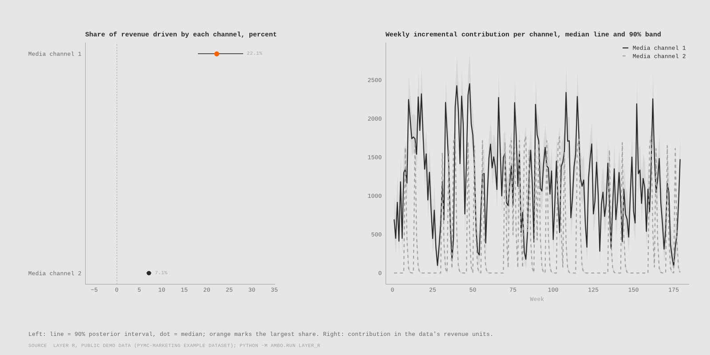
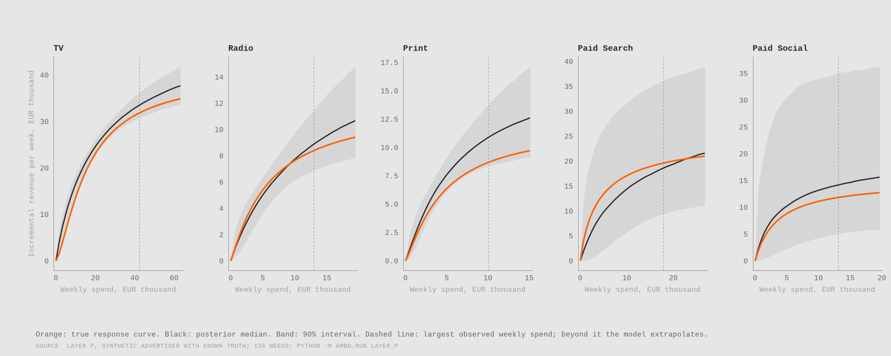
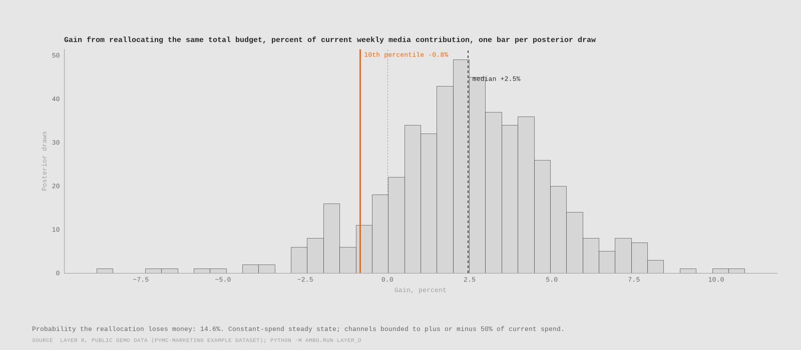

# Austrian MMM and Budget Optimizer

For one advertiser, which channels contributed incrementally, how far off were
platform-reported numbers, and what does a reallocation gain?

"Austrian" names the setting the model is built for, not the data behind it: the
Austrian public-holiday calendar as a control, weekly grain, euro and
contribution-margin logic for an Austrian advertiser. It is validated on synthetic
data with known truth and demonstrated on public data, pending a client swap-in. No
Austrian client data was used.



On synthetic data with known truth, the estimated response curves cover the true curves on 91 percent of the observed spend range and 26 of 28 true parameters fall inside their 90 percent intervals; the platform report credits Paid Search with 45 percent more revenue than it really adds, and gives the offline channels nothing.

On the public demo data (five named channels), the share of revenue each channel drives is TV 6.0 percent (3.5 to 10.0); Out-of-home 2.7 percent (0.3 to 7.9); Print 1.8 percent (0.4 to 5.5); Facebook 2.5 percent (0.6 to 5.5); Search 3.2 percent (0.3 to 10.5).

Reallocating the same budget gains 15.1 percent of current media contribution (10th percentile 8.8 percent); the shift is recommended.

Contribution profit is the north star, not revenue: a channel that returns less
than the breakeven return on ad spend destroys margin however large its revenue
looks. Customer acquisition cost is fully loaded or it is fiction. Attribution is a
hypothesis until it has been tested against something outside the platform's own
reporting. Platform-reported numbers are claims, not measurements, because every
platform counts the conversions it can see and credits itself for demand that would
have arrived anyway. The model below is built to test those claims.

## Method

- Data: weekly spend per channel and revenue. Layer P is a synthetic advertiser with 156 weeks and five channels (TV, Radio, Print, Paid Search, Paid Social) whose true parameters are written to data/synthetic/truth.json; Layer R is Robyn's simulated weekly dataset with five named channels in money units (see data/README.md). Public demo data; a real-data swap-in is planned.
- Adstock: geometric carry-over per channel, so this week's spend keeps working in the following weeks with a decay rate the model estimates.
- Saturation: a Hill curve per channel on the adstocked spend, with a half-saturation point and a slope, so returns diminish as spend grows.
- Seasonality and controls: a linear trend, two yearly Fourier pairs, and one control (a public-holiday week indicator on Layer P, competitor sales on Layer R).
- Priors: weakly informative and identical across channels, on scaled data, so that the estimates come from the data and not from a prior that knows the answer. Each prior and its reasoning is in the model docstring.
- Sampler: NUTS (nutpie), 2 chains, 1000 tuning and 1000 draws per chain, target acceptance 0.9, raised to 0.99 by the recorded ladder after divergences.
- Diagnostics: R-hat below 1.01, effective sample size above 400, zero divergences; written to diagnostics.json next to every fit.
- Holdout protocol: fit on the first 130 weeks, forecast the rest with the actual spend, and report MAPE and 90 percent interval coverage against a seasonal-naive and a ridge-regression baseline.

## Proof on known truth



Before trusting the model on any advertiser's data, it had to recover a truth it was handed. On the synthetic advertiser the estimated response curves cover the true curves on 91 percent of the grid points inside the observed spend range (worst channel, TV: 56 percent), with a mean error of at most 13.6 percent of the true curve's height. 26 of 28 individual parameters fall inside their 90 percent intervals.

The misses follow a known trade-off, not a bug: 5 of 5 effect sizes and 5 of 5 half-saturation points have medians above the truth, because a curve that rises higher but saturates later fits the same observed weeks. Recovery is therefore judged on curves and shares, which are what a budget decision uses, not on point parameters. Revenue shares are covered for 4 of 5 channels; the exception sits just outside its interval: TV (the largest channel by spend): true share 9.5 percent against an interval of 9.7 to 11.4.

## Results: holdout forecast against two baselines

Layer P, synthetic data, 26 holdout weeks:

| Model | MAPE | 90 percent interval coverage |
|---|---|---|
| Seasonal naive | 9.6 percent | 92 percent |
| Ridge regression | 4.7 percent | 92 percent |
| Bayesian MMM | 3.0 percent | 85 percent |

The MMM has the lowest point error here. Its case does not rest on that: the baselines say nothing about which channel earned the revenue. Its 90 percent intervals covered 85 percent of holdout weeks, 5 points below nominal, so the intervals are slightly too narrow and the model is a little overconfident; the baselines' wider intervals covered more.

Layer R, public demo data, 26 holdout weeks:

| Model | MAPE | 90 percent interval coverage |
|---|---|---|
| Seasonal naive | 22.3 percent | 96 percent |
| Ridge regression | 5.1 percent | 100 percent |
| Bayesian MMM | 7.9 percent | 100 percent |

The MMM loses on point error to the ridge regression baseline on this data. That is reported as it comes out: the case for the MMM is interpretability (which channel earned the revenue, with intervals), not always accuracy. Its 90 percent intervals covered 100 percent of holdout weeks, more than the nominal 90, so on this data the intervals are wider than they need to be.

## Decision

Same total weekly budget, reallocated. Spend and contribution are weekly, in the dataset's money units; marginal ROAS is revenue per unit of spend:

| Channel | Current weekly spend | Recommended | Change | Marginal ROAS at current (90 percent interval) | Marginal ROAS at recommended (90 percent interval) | Contribution at recommended (90 percent interval) |
|---|---|---|---|---|---|---|
| TV | 14844 | 22266 | +50 percent | 7.26 (4.38 to 10.72) | 5.92 (3.38 to 8.88) | 206826 (108994 to 299916) |
| Out-of-home | 43218 | 34723 | -20 percent | 0.75 (0.10 to 1.68) | 0.90 (0.11 to 1.97) | 59871 (4550 to 168928) |
| Print (held by the rule) | 3729 | 3729 | +0 percent | 7.81 (1.22 to 16.01) | 7.81 (1.22 to 16.01) | 36866 (4278 to 135766) |
| Facebook | 2146 | 3218 | +50 percent | 20.53 (4.76 to 45.52) | 16.34 (3.43 to 39.90) | 79137 (14319 to 155996) |
| Search (held by the rule) | 5916 | 5916 | +0 percent | 7.68 (0.89 to 25.55) | 7.68 (0.89 to 25.55) | 60733 (7490 to 195917) |

Gain from the reallocation: median 15.1 percent of current media contribution, 10th percentile 8.8 percent, probability of a loss 0.0 percent. Recommend the shift.

Decision rule: Shift budget toward a channel only while the lower bound of its marginal ROAS 90 percent interval stays above the breakeven ROAS, and only if the 10th percentile of the reallocation gain is positive. Breakeven ROAS is 2.50 at a contribution margin of 40 percent (an assumption stated in the config). The breakeven gate held Print and Search at current spend: the lower bound of their marginal ROAS interval falls below breakeven, so no budget moves toward them however high their median.

With 200000 more per year, spread over 52 weeks, media contribution rises by a median 17.4 percent (10th percentile 10.6 percent); the rule says recommend. Where the extra budget goes, channel by channel, and how likely that call is wrong, is in reports/layer_d/next_200k.md.



## Reproduce

```
uv sync
uv run python -m ambo.run layer_p
uv run python -m ambo.run layer_r && uv run python -m ambo.run layer_d
```

## Limitations

- Layer R runs on Robyn's simulated weekly dataset: five named channels and revenue in the dataset's money units, whose currency its authors do not name. Shares, ROAS ratios and the breakeven test are meaningful; the amounts are not euros. No Austrian client data was used; a real-data swap-in is planned.
- One model form (geometric adstock, Hill saturation, additive baseline) is assumed; recovery on Layer P shows the sampler recovers that form, not that reality has it.
- Effect size and half-saturation trade off against each other, so individual point parameters are recovered less well than curves and shares; the proof section states the direction of that bias.
- Weekly national data cannot separate channels whose spend moves together; the intervals widen accordingly and the optimiser stays inside the bounds set in the config.
- The optimiser assumes response curves hold at new spend levels, competitors do not react, and a constant weekly spend reaches its steady state.

The full list, with what each limit means for a client engagement, is in
[LIMITATIONS.md](LIMITATIONS.md); the decisions behind the build are in
[docs/adr/](docs/adr/README.md) and the dashboard feed in [docs/dashboard_handoff.md](docs/dashboard_handoff.md).

## What I would do differently with production data

- Geo-level weekly data, so that regional variation in spend identifies the response
  curves instead of time alone.
- Calibration against lift tests: geo experiments or holdouts on at least one channel,
  used as priors or as a check on the incremental estimates.
- Media cost inflation, so that spend is converted to reach before modelling and a
  price rise is not mistaken for saturation.
- Competitor spend as a control, since a rival's campaign moves the baseline.
- Longer history for seasonality: three full years at minimum, with the calendar of
  promotions written down rather than reconstructed.
- Data-quality gates before modelling: gapless weeks, spend reconciled to invoices,
  platform exports reconciled to the ad accounts, and outliers explained before they
  enter the fit.

## Status

Built layers: Layer P (synthetic truth and parameter recovery), Layer R (public demo data), Layer D (budget optimiser and decision rule). Everything in this README regenerates from the three commands above. Date: 2026-09-16.
