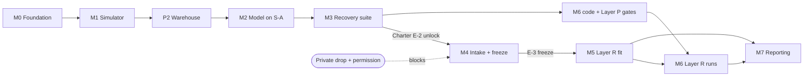
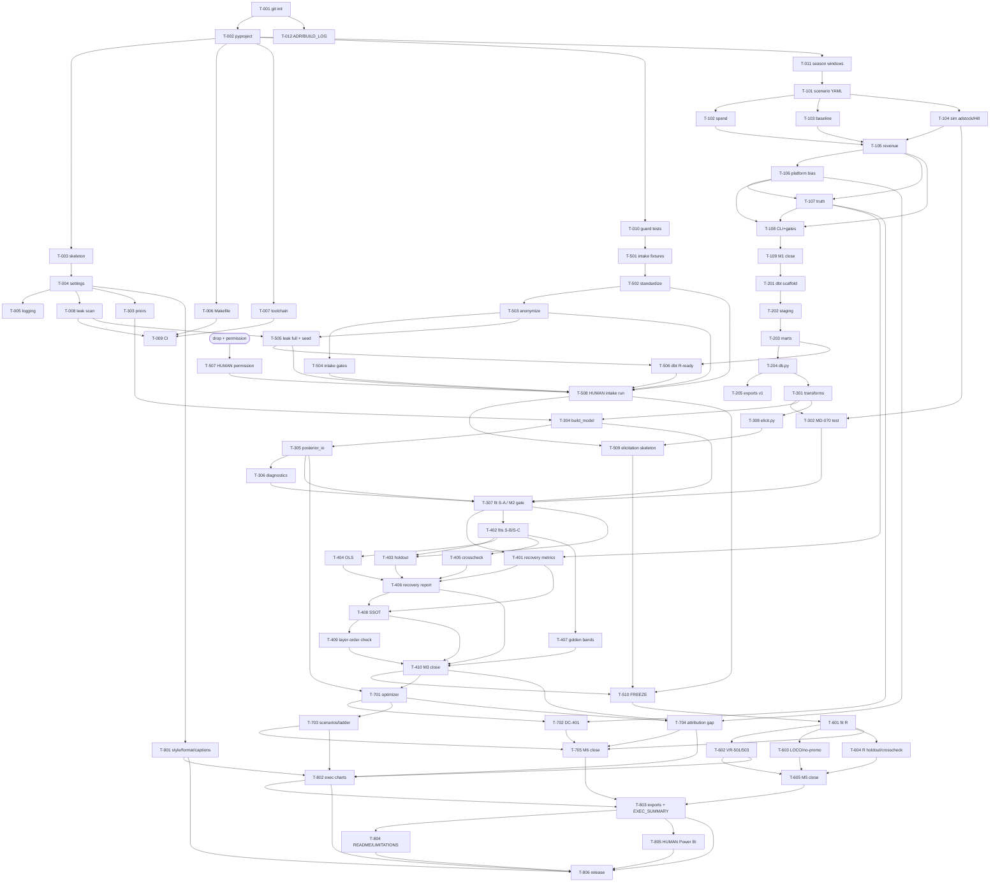

# 04 — DEPENDENCY GRAPHS, CRITICAL PATH, PARALLEL WORK

## 1. Module dependency graph (allowed imports)

```mermaid
graph TD
    common[ambo/common]
    simulate[ambo/simulate] --> common
    intake[ambo/intake] --> common
    model[ambo/model] --> common
    validate[ambo/validate] --> common
    validate --> model
    decide[ambo/decide] --> common
    decide --> modelio[model.posterior_io / transforms]
    report[ambo/report] --> common
    report --> modelio
    dbt[dbt warehouse] -.reads.-> synth[data/synthetic]
    dbt -.reads.-> anon[data/real_anon]
    model -.reads via db.py.-> dbt
    simulate -.writes.-> synth
    intake -.writes.-> anon
    simulate -. seed CSV only .- dbt

    classDef forbidden stroke:#c00,stroke-dasharray: 5 5;
```

**Forbidden edges (guard-tested, T-010):** `simulate ↔ model` (either direction),
`pymc_marketing` outside `validate/crosscheck.py`, `requests` anywhere,
`pm.sample` outside `model/fit.py`, CSV reads inside `model/`/`decide/` (mart-only,
AD-030).

## 2. Milestone dependency graph



Note the deliberate split of M6: its code and both its Layer P gates (DC-401,
DC-502) depend only on M3, not on the drop.

## 3. Execution dependency graph (task level)



## 4. Critical path

```
T-001 → T-002 → T-003 → T-004 → (T-006..T-011 cluster) → T-101 → T-102/103/104
→ T-105 → T-106 → T-107 → T-108 → T-109 → T-201 → T-202 → T-203 → T-204
→ T-301 → T-302/304 → T-305 → T-306 → T-307 [S-A fit compute]
→ T-402 [S-B/S-C fits compute] → T-401/406/407/408/409 → T-410
→ ⏳ T-507/T-508 (EXTERNAL: drop + permission) → T-510 [freeze]
→ T-601 [R fit] → T-602..605 → T-705 → T-803 → T-804/805 → T-806
```

The single external wait (drop + permission) sits **after T-410** on the critical
path. Everything between "drop requested" and "drop received" should be spent on
the parallel tracks below so the wait costs zero calendar time. The Charter's
effort budget puts ~9 working days on this path; the wait is absorbed if Phases
0–4 + the pre-drop tracks fill it.

## 5. Parallelizable work (within the main flow)

| Track | Tasks | May run parallel to | Constraint |
|---|---|---|---|
| A: Foundation cluster | T-005..T-012 | each other | T-009 last (needs 006/007/008) |
| B: Simulator internals | T-102, T-103, T-104 | each other | all feed T-105 |
| C: Model prep | T-303, T-308 | T-301/302 | merge before T-304/T-510 |
| D: Recovery satellites | T-403, T-404, T-405, T-407 | each other | after T-402 |
| E: Intake codebase | T-501..T-506 | **all of P2–P4** | only needs P0 + (T-506: T-203) |
| F: Decision layer code | T-701..T-704 | P5 wait, P6 | needs T-410 (posteriors+truth) |
| G: Report infra | T-801; T-802 Layer P variants | P4 onward | pull T-801 before T-406 (recommended) |
| H: Sensitivity fits | T-602/603/604 | each other | serialize on compute budget §7 |

## 6. Blocked / risky / drop-dependent work

**Blocked until external event (private drop + permission):**
T-507, T-508, T-509 (channel list), T-510, all of P6, T-705, T-803/804 final
content, T-805.

**Drop-independent backlog to execute during the wait (ordered by value):**
1. T-501…T-506 (entire intake codebase on fixtures) — makes M4 a half-day of
   human execution instead of a build.
2. T-701…T-704 (entire decision layer, gated on Layer P).
3. T-801 + T-802 Layer P chart variants (also de-risks the Charter §7 degradation
   path — those variants ARE the degraded deliverable).
4. T-804 degradation-framing draft (RB §6.1 variant).

**Risky work (schedule buffers + early spikes):**
| Task | Risk | Why |
|---|---|---|
| T-304/T-307 | High | First contact with sampler health; MD-073 ladder may trigger |
| T-402 (S-C) | High | Hostile scenario; wide posteriors expected, gates deliberately looser — do not overreact |
| T-405 | Medium | pymc-marketing API drift vs pin |
| T-409 | Medium | Git-plumbing edge cases (merges, follows) — test on throwaway repos |
| T-508 | High | Real-data messiness unknown until drop; AG gates may force ADRs |
| T-601 | High | Short-data fitting; MD-074 relaxations exist for a reason |
| T-009 smoke | Medium | 15-min CI budget with pytensor compile — cache aggressively |

## 7. Compute plan (BP-D-18 ledger)

Full-budget fits (MD-050; est. 15–35 min each on 4 cores — measure at T-307 and
update this table in BUILD_LOG):

| # | Fit | Phase | Committed artifact |
|---|-----|-------|--------------------|
| 1 | P-SA | P3 | P-SA.parquet |
| 2–3 | P-SB, P-SC | P4 | P-SB/P-SC.parquet |
| 4–6 | holdout S-A/S-B/S-C | P4 | holdout CSVs only |
| 7 | P-SB__flat (VR-503) | P6 (or P4 slack) | P-SB__flat.parquet |
| 8 | R | P6 | R.parquet |
| 9 | R__flat | P6 | R__flat.parquet |
| 10 | R__loco-<ch> | P6 | R__loco-*.parquet |
| 11 | R__nopromo | P6 | R__nopromo.parquet |
| 12 | R holdout | P6 | holdout CSV |
| 13–14 | crosscheck S-B, R | P4/P6 | summary stats only |

Rules: fits are explicit make targets, never CI (EB-061), never implicit in
`make all` (BP-D-20); posteriors written atomically (EB-050); wall-times logged to
BUILD_LOG after each phase — if cumulative compute exceeds 2× the estimate, treat
as an effort-budget event (Charter §5 tripwire).
