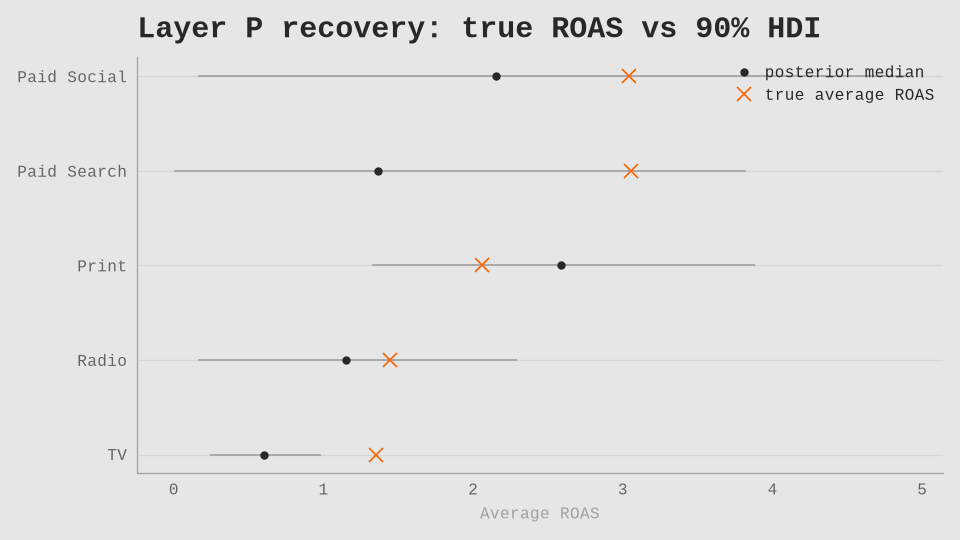

# Recovery report

> Generated by `python -m ambo.run layer_p` from the Layer P posterior.
> Do not hand-edit.

## Verdict

Five-channel Layer P (156 weeks, seed 101): **RED**.

## Gate table

| Gate | Result | Detail |
|---|---|---|
| VR-301 | PASS | 4/5 channels in 90% HDI (need ≥ 4) |
| VR-302 | FAIL | Spearman 0.600 (need ≥ 0.70) |
| VR-303 | FAIL | MAE% median 19.42 (median≤15, per≤25) |
| VR-305 | FAIL | half-life ranking failed |
| VR-306 | PASS | |media share Δ|=0.0662 (need ≤ 0.10) |

## ROAS recovery

True average ROAS is ×; posterior median is a dot with 90% HDI whiskers.

| Channel | True ROAS | Posterior median | 90% HDI | In HDI | curve MAE% |
|---|---:|---:|---|:---:|---:|
| `tv` | 1.35 | 0.61 | [0.24, 0.98] | no | 19.4 |
| `radio` | 1.45 | 1.15 | [0.16, 2.29] | yes | 17.1 |
| `print` | 2.06 | 2.58 | [1.32, 3.88] | yes | 51.1 |
| `paid_search` | 3.06 | 1.37 | [0.00, 3.82] | yes | 27.7 |
| `paid_social` | 3.04 | 2.15 | [0.16, 4.89] | yes | 8.5 |

## Holdout

Weeks 131–156, conditional on actual spend. Model MAPE 0.0418 vs seasonal-naive 0.0784 (beats naive: yes). 90% coverage 0.885.

## OLS baseline

OLS+HC1 with adstock fixed at the prior-mode λ and no Hill. Signs ship as they are (VR-601).

| Channel | OLS coef | HC1 se | Bayesian median ROAS | same sign |
|---|---:|---:|---:|:---:|
| `tv` | 0.675 | 0.203 | 0.605 | yes |
| `radio` | 1.565 | 0.385 | 1.148 | yes |
| `print` | 1.459 | 0.284 | 2.584 | yes |
| `paid_search` | 2.081 | 2.577 | 1.365 | yes |
| `paid_social` | 1.845 | 0.640 | 2.152 | yes |

## Budget reallocation (Layer P, Charter §7)

Expected weekly media-contribution gain vs historical mix: 3674 € (90% HDI [-1655, 8826]), 4.06% of mean weekly revenue (90% HDI [-1.83, 9.76]). Steady-state adstock of a constant weekly allocation equals the allocation itself (MD-020 normalised weights; DC-201).

| Channel | Historical €/wk | Optimal €/wk | Binding 1.3× cap |
|---|---:|---:|:---:|
| `tv` | 1860 | 29 | no |
| `radio` | 597 | 70 | no |
| `print` | 953 | 4086 | no |
| `paid_search` | 2500 | 1348 | no |
| `paid_social` | 2231 | 2607 | no |

## What this does and does not prove

This recovery suite shows that the raw-PyMC MMM recovers disclosed simulator truth it was never shown. Recovery is gated on ROAS and response-curve shape at observed spend, not on point recovery of Hill K and s. The simulator uses raw geometric recursion; the model uses a truncated convolution with MD-020 normalised weights (steady-state adstock of a constant weekly allocation equals the allocation itself; DC-201) — agreement is evidence rather than a circular identity. Layer R (real agency data) is not in this repository; Charter §7 degradation applies (ADR-012). The optimiser result is an in-sample counterfactual under the fitted model: response curves are assumed to hold and competitors do not react. No channel is pushed beyond 1.3× its historically observed weekly spend. Platform-reported conversions remain the object of the attribution-gap comparison, never a calibration target.
