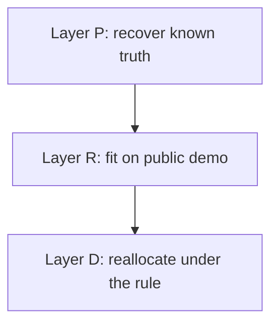

# Austrian MMM and Budget Optimizer


[](LICENSE)
[](pyproject.toml)
[](https://github.com/RafaelBraga-Kribitz/austrian-mmm-budget-optimizer/actions)
[](#status)

**Status:** Complete

For one advertiser, which channels contributed incrementally, how far off were
platform-reported numbers, and what does a reallocation gain?

"Austrian" names the setting the model is built for, not the data behind it: the
Austrian public-holiday calendar as a control, weekly grain, euro and
contribution-margin logic for an Austrian advertiser. It is validated on synthetic
data with known truth and demonstrated on public data, pending a client swap-in. No
Austrian client data was used.

{{headline_lines}}

Contribution profit is the north star, not revenue: a channel that returns less
than the breakeven return on ad spend destroys margin however large its revenue
looks. Customer acquisition cost is fully loaded or it is fiction. Attribution is a
hypothesis until it has been tested against something outside the platform's own
reporting. Platform-reported numbers are claims, not measurements, because every
platform counts the conversions it can see and credits itself for demand that would
have arrived anyway. The model below is built to test those claims.


## Decision

{{decision_section}}

## Explore this project

| Audience | Start here |
|---|---|
| Recruiter | [Decision](#decision) and the hero chart |
| Hiring manager | [Decision](#decision), [Method](#method), and [Validation](#validation) |
| Technical reviewer | [Architecture](#architecture), [Reproduce](#reproduce), and `src/ambo/` |
| Auditor | [Data](#data), [Validation](#validation), and [Limitations](#limitations) |

## Results

{{holdout_section}}

## Method

{{method_bullets}}

## Data

Weekly spend per channel and revenue. No Austrian client data was used.

{{data_table}}

Layer R amounts are not euros. Shares, ROAS ratios and the breakeven test are the quantities that travel. A real-data swap-in is planned.

## Validation

{{proof_section}}

Holdout MAPE and interval coverage against two baselines are in Results. Sampler gates are written to `diagnostics.json` next to every fit.

## Architecture



Layer P is the validation instrument: a disclosed data-generating process the sampler must recover before Layer R numbers are treated as a decision. Layer R fits the same model on Robyn's public demo file. Layer D takes the Layer R posterior and reallocates spend under the breakeven rule.

| Piece | Role |
|---|---|
| PyMC and nutpie | Bayesian MMM, NUTS sampling |
| uv | Locked install and run |
| bk-viz | Chart theme |

## Reproduce

```bash
uv sync
uv run pytest -m "not slow"
uv run python -m ambo.run layer_p
uv run python -m ambo.run layer_r && uv run python -m ambo.run layer_d
uv run python scripts/render_readme.py
```

This README is rendered from `scripts/readme_template.md` by `scripts/render_readme.py`, which reads every number from `reports/`. The three layer commands regenerate those artifacts; `tests/test_readme_numbers.py` fails when the committed README, memo or German summary no longer match what the renderers produce.

## Limitations

{{limitations}}

The full list, with what each limit means for a client engagement, is in
[LIMITATIONS.md](LIMITATIONS.md); the decisions behind the build are in
[docs/adr/](docs/adr/README.md) and the dashboard feed in [docs/dashboard_handoff.md](docs/dashboard_handoff.md).

## What I would do differently with production data

- Geo-level weekly data, so that regional variation in spend identifies the response
  curves instead of time alone.
- Calibration against lift tests: geo experiments or holdouts on at least one channel,
  used as priors or as a check on the incremental estimates.
- Media cost inflation, so that spend is converted to reach before modelling and a
  price rise is not mistaken for saturation.
- Competitor spend as a control, since a rival's campaign moves the baseline.
- Longer history for seasonality: three full years at minimum, with the calendar of
  promotions written down rather than reconstructed.
- Data-quality gates before modelling: gapless weeks, spend reconciled to invoices,
  platform exports reconciled to the ad accounts, and outliers explained before they
  enter the fit.

## Repository structure

| Path | Responsibility |
|---|---|
| `src/ambo/` | Model, sampler, optimiser, charts, configs |
| `data/` | Layer P synthetic advertiser and Layer R public demo file |
| `reports/` | Layer P, R and D artifacts that the README is rendered from |
| `scripts/` | README, memo and German summary renderers, notebook builder, dashboard export |
| `tests/` | Recovery, transforms, optimiser, and the README-numbers gate |
| `docs/` | Specs, ADRs, dashboard handoff, build log |
| `notebooks/` | Walkthrough notebook |

## Status

**Status:** Complete

{{status_line}}

## License

MIT License. See [LICENSE](LICENSE).

## Author

<table>
  <tr>
    <td width="110">
      
    </td>
    <td>
      <strong>Rafael Braga-Kribitz</strong><br />
      Seiersberg-Pirka, Austria · Portfolio project, 2026<br />
      <a href="https://www.linkedin.com/in/rafaelbragakribitz/">LinkedIn</a>
      ·
      <a href="mailto:rafaelbragakribitz@gmail.com">rafaelbragakribitz@gmail.com</a>
    </td>
  </tr>
</table>
